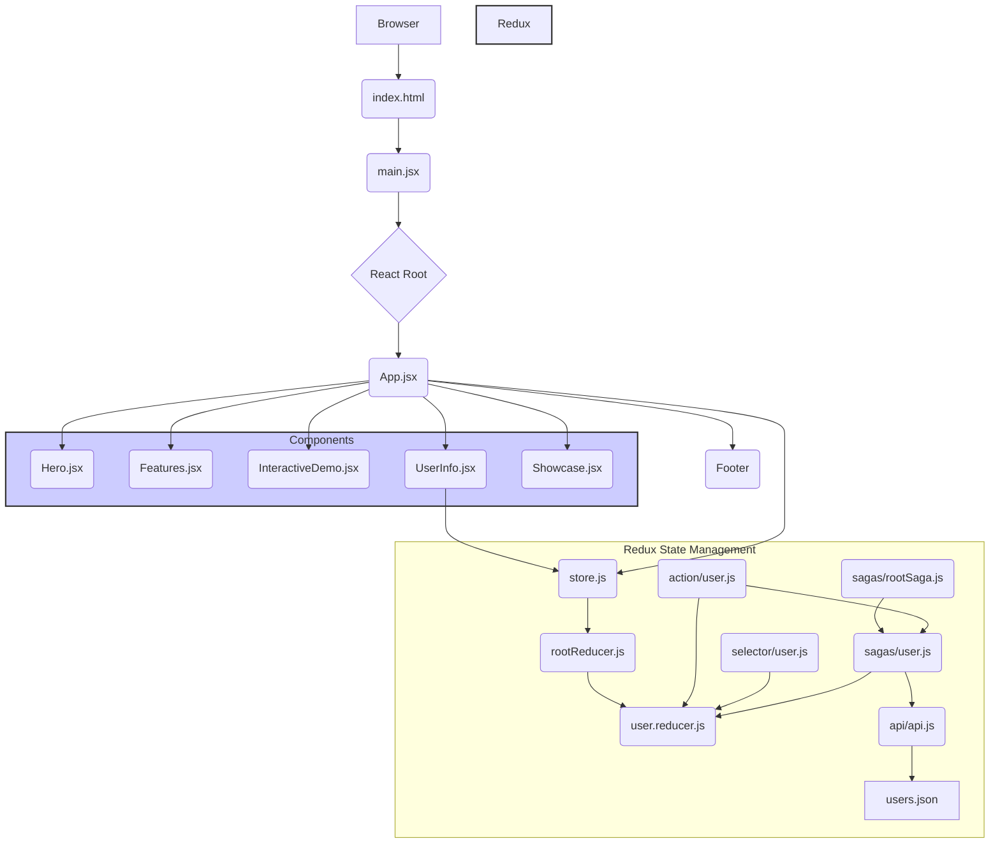

# Architectural Documentation - AI DocGen Demo v2

## 1. Introduction

This document outlines the high-level architecture of the AI DocGen Demo v2 application. The application is a single-page web application built with React, leveraging Redux for state management and Redux Saga for asynchronous operations. It showcases interactive UI components and demonstrates how AI can be integrated for documentation generation.

## 2. Architectural Patterns

The application follows a **Component-Based Architecture** with a clear separation of concerns. Key patterns include:

*   **Container/Presentational Components:** While not strictly enforced, components like `App.jsx` act as containers, orchestrating child presentational components (`Hero`, `Features`, `InteractiveDemo`, `Showcase`, `UserInfo`).
*   **State Management:** Redux is used for global state management, providing a single source of truth for application data.
*   **Asynchronous Operations:** Redux Saga is employed to handle side effects, such as fetching data from APIs or JSON files.
*   **Reusable UI Components:** Smaller, self-contained components like `FeatureCard`, `ShowcaseItem`, and `PreviewCard` are used to build up the UI.

## 3. Module Combinations and Structure

The codebase is organized into several key directories:

*   **`src/`**: The root directory for application source code.
    *   **`index.css`**: Global CSS styles for the application.
    *   **`App.css`**: Component-specific CSS for the main `App` component and its children.
    *   **`main.jsx`**: The entry point of the React application, responsible for rendering the root component and setting up the Redux Provider.
    *   **`App.jsx`**: The main application component that orchestrates the rendering of various sections.
    *   **`components/`**: Contains reusable UI components.
        *   `Hero.jsx`: Displays the main hero section with a title and subtitle.
        *   `Features.jsx`: Showcases the application's key features.
        *   `InteractiveDemo.jsx`: A component demonstrating real-time UI customization and text manipulation.
        *   `UserInfo.jsx`: Displays user information fetched from the Redux store.
        *   `Showcase.jsx`: Presents a gallery of project examples.
        *   `*.css`: Component-specific stylesheets.
    *   **`assets/json/`**: Stores static JSON data, such as user profiles.
    *   **`redux/`**: Manages the application's global state.
        *   `store.js`: Configures the Redux store with Redux Toolkit and Saga middleware.
        *   `rootReducer.js`: Combines all individual reducers into a single root reducer.
        *   `reducer/`**: Contains individual reducers for different parts of the state.
            *   `user.reducer.js`: Handles user-related state.
        *   `action/`**: Defines action types and creators.
            *   `user.js`: User-specific actions.
        *   `selector/`**: Contains memoized selectors for efficient data retrieval from the Redux store.
            *   `user.js`: User-specific selectors.
        *   `sagas/`**: Implements Redux Saga logic for asynchronous operations.
            *   `rootSaga.js`: The main saga that orchestrates all other sagas.
            *   `user.js`: Sagas related to user data fetching.
        *   `helper/`**: Utility functions for Redux.
            *   `createAsyncActionType.js`: Helper to create standard async action types.
    *   **`api/api.js`**: Contains functions for interacting with external data sources (e.g., fetching JSON files).

## 4. Global State Management

Redux is the central piece for managing the application's global state.

*   **Store:** Configured using `configureStore` from Redux Toolkit, it centralizes all application state.
*   **Reducers:** `user.reducer.js` manages the state related to users, including a list of users (`users`), the currently selected user (`currentUser`), loading status, and errors.
*   **Actions:** Defined in `action/user.js`, these describe events that can occur in the application. Asynchronous actions use a `_REQUEST`, `_SUCCESS`, `_ERROR` pattern.
*   **Selectors:** `selector/user.js` provides memoized functions (`getUsers`, `getCurrentUser`) to efficiently access specific pieces of state from the Redux store. This prevents unnecessary re-renders.
*   **Redux Saga:** Used for handling side effects. `user.js` saga watches for `GET_USERS._REQUEST` and calls the `getUsersApi` to fetch data, then dispatches `GET_USERS._SUCCESS` or `GET_USERS._ERROR` based on the outcome.

**Key State Variables:**

*   `user.users`: An array of user objects.
*   `user.currentUser`: The currently selected user object.
*   `user.loading`: Boolean indicating if data is being fetched.
*   `user.error`: Stores any error messages during data fetching.

## 5. Routing

This application is a **Single-Page Application (SPA)** and does not implement client-side routing in the traditional sense (e.g., using React Router). Navigation is primarily achieved through:

*   **Anchor Links:** The "Inizia Ora" button in the `Hero` component links to the `#interactive-demo` section, causing the browser to scroll to that element.
*   **Component Rendering:** All major sections (`Hero`, `Features`, `InteractiveDemo`, `UserInfo`, `Showcase`) are rendered directly within the `App.jsx` component. The order of rendering defines the visual flow of the page.

## 6. Architectural Diagram

